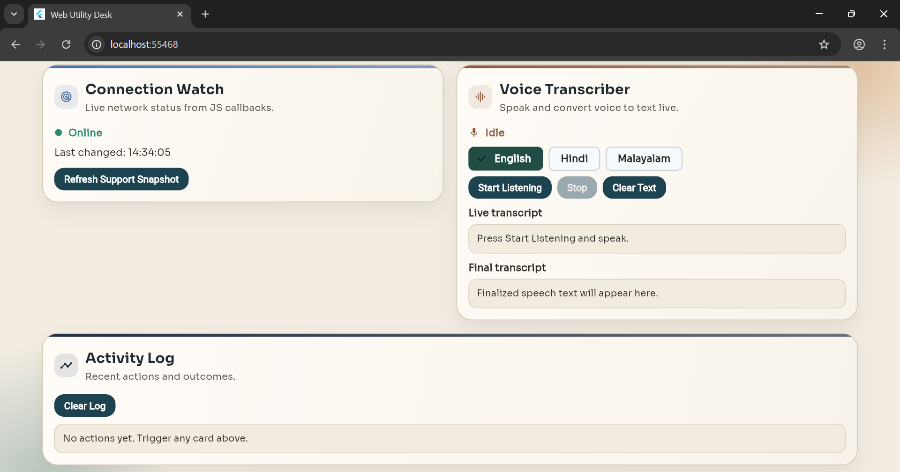

# 🌐 Web Utility Desk (Flutter Web + JS Interop)

A polished Flutter Web utility app built to demonstrate practical JavaScript interoperability,  
including browser API integration, callback bridging, Promise handling, and reactive UI updates.

The project uses **`dart:js_interop` + custom `web/script.js` wrappers** to connect Dart code with  
real browser capabilities like Clipboard, Notifications, Network listeners, and Speech Recognition.

---

## ✨ Features

- 📋 Copy text to browser clipboard and read clipboard contents back  
- 🔔 Request notification permission and trigger browser notifications  
- 🌐 Track online/offline status with live network event updates  
- 🎙️ Start/stop speech recognition using Web Speech API  
- 🗣️ Live + finalized speech transcript rendering in the UI  
- 🌍 Speech language switching via chips: English, Hindi, Malayalam  
- 🔒 Language chips are locked while speech listener is active  
- ✅ Browser capability support badges (Clipboard, Notifications, Speech, Network)  
- 🧾 Activity log panel for system actions, success states, and errors  
- 🎨 Responsive modern UI with reusable design components  

---

## 🧠 Architecture & Design Decisions

- **🗂️ Clear separation of concerns**
  - `lib/js_bindings.dart` contains all JS interop function signatures  
  - `lib/web_api_service.dart` orchestrates interop calls and callback subscriptions  
  - `lib/interop_models.dart` stores typed models/enums for support/action/speech state  
  - `lib/ui_components.dart` centralizes reusable UI primitives (cards, buttons, chips, outputs)  
  - `lib/js_interop_example.dart` focuses on screen state + feature wiring only  

- **⚙️ Strongly typed JS bridge layer**
  - Browser-facing JS APIs are exposed through dedicated wrappers in `web/script.js`  
  - Dart never calls browser globals directly from UI logic  
  - JSON payloads are parsed into typed models for predictable state handling  

- **🔁 Event-driven interop patterns**
  - Online/offline browser events are pushed from JS to Dart callbacks  
  - Speech recognition result/state events stream from JS to Dart in real time  
  - Listener lifecycle is handled explicitly with subscribe/unsubscribe methods  

- **🧵 Async-safe UI updates**
  - Promise-based APIs (clipboard + permissions) are awaited in service methods  
  - Screen updates check lifecycle safety and maintain separate UI state buckets  
  - Logs are capped to avoid unbounded in-memory growth  

- **🧩 Maintainable theming and visual system**
  - App-wide typography + colors are centralized in `lib/app_theme.dart`  
  - Reusable card/button/output widgets enforce consistent UI behavior and style  

---

## 🛠️ Tech Stack

- 📱 Flutter (Material 3, Web target)  
- 🎯 Dart  
- 🔗 `dart:js_interop` (JS bridge)  
- 🧠 Browser APIs (Clipboard, Notifications, Network, Web Speech API)  
- 🔤 `google_fonts` (Plus Jakarta Sans + Sora typography)  

---

## 📁 Project Structure

```text
lib/
  app_theme.dart
  interop_models.dart
  js_bindings.dart
  js_interop_example.dart
  main.dart
  ui_components.dart
  web_api_service.dart
web/
  index.html
  script.js
test/
  widget_test.dart
```

---

## 🖼️ Screenshots

| Dashboard | Voice Transcriber | Activity Log |
|---|---|---|
|  |  |  |

---

## 🎯 Key Takeaways

- JavaScript interop in Flutter Web becomes clean when wrappers and bindings are separated  
- Typed model parsing keeps browser callback payloads predictable and maintainable  
- Explicit listener lifecycle management prevents stale callback issues  
- UI responsiveness improves with clear success/error/action logging  
- Refactoring into theme/models/service/components makes future changes significantly easier  

---

## 🚧 Possible Enhancements

- 🧠 Add command history export and copy-all transcript functionality  
- 🌍 Add more speech locales and runtime auto-language detection  
- 🔄 Add retry actions for failed browser operations  
- 🧪 Add targeted tests for service parsing and speech/network callback flows  
- 📦 Split feature cards into dedicated files for even finer module boundaries  
- 🛡️ Add browser-specific compatibility hints/tooltips per unsupported API  

---

## 👨‍💻 Author

**GOKUL HARI**  
Software Engineer
